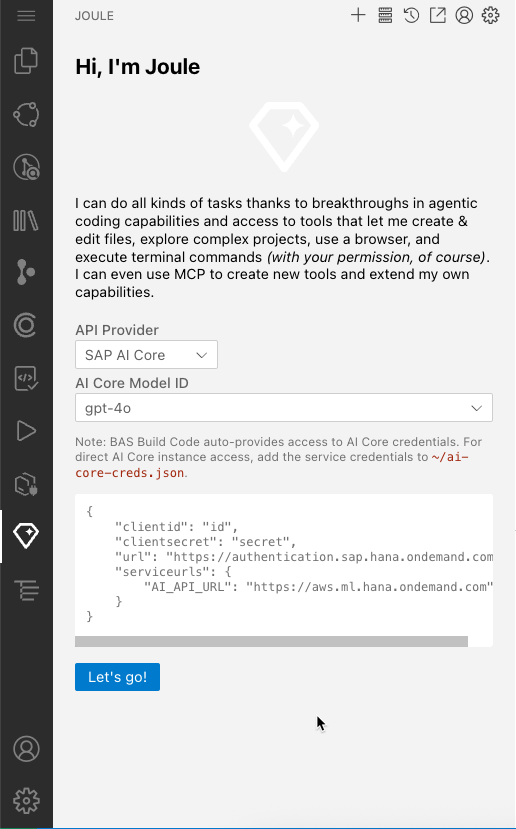
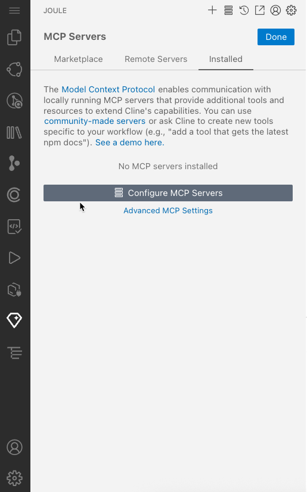
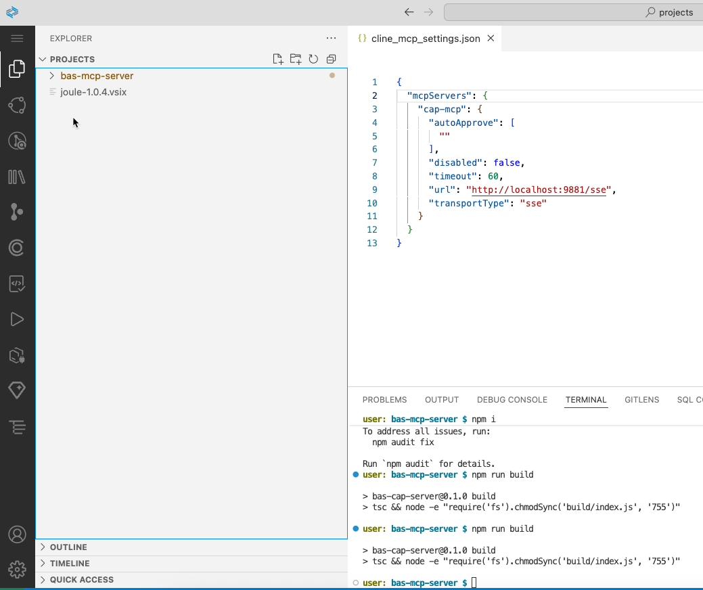
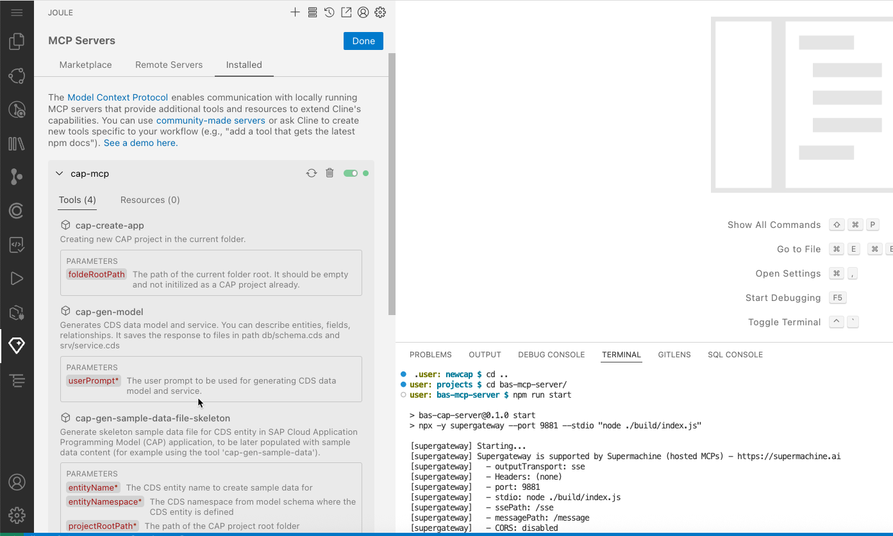
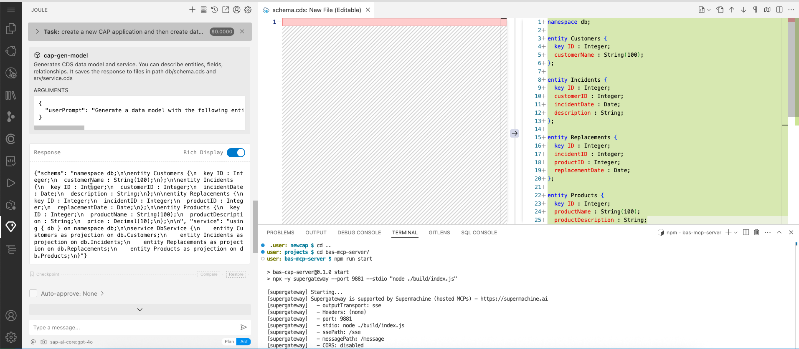

## Instructions for demo Cline in BAS with CAP custom model MCP server 

1. Install this vsix in `BAS Build Code Canary` Landscape - you'll need to require permissions to download [Download here](https://sap-my.sharepoint.com/my?id=%2Fpersonal%2Fvered%5Fconstantin%5Fsap%5Fcom%2FDocuments%2FAttachments%2Fjoule%2D1%2E0%2E4%2Evsix&parent=%2Fpersonal%2Fvered%5Fconstantin%5Fsap%5Fcom%2FDocuments%2FAttachments)  (It can also be generated by running in the `main` branch `npm i` && `npm run compile` && `npm run pack`)
2. You can remove the original Joule extension so only the cline `Joule` will appear.
3. Setup to work with `SAP AI Core provider`
   

5. Click on `Configure mcp servers` and set up `bas-mcp-server` according to the instructions [here](https://github.wdf.sap.corp/devx-wing/bas-mcp-server/tree/main)

See the following configurations:

6. Pay attention to the file `ai-core-utils.ts` and make sure the `CUSOM_MODEL_NAME` and `DEPLOYMENT_ID` are pointing to a RUNNING deployment of custom cap llm model from `oss-llm` resource group. We often delete this deployment for saving costs so it can change.

7. create an empty folder and type a prompt in cline, for example `create a new CAP application and then create data model where customers can report incidents. Each incident includes replacement items, and each replacement is linked to a product, which has its own entity.`

8. You can see it will call the first tool to create CAP application and then the second tool to generate model artifact:

